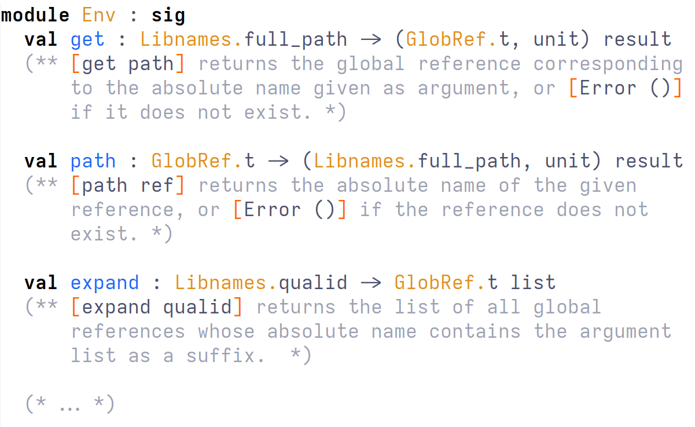

# MLtac2: Ltac2 APIs for OCaml

MLtac2 is a simple library that packages part of the Ltac2 APIs for use in OCaml plugins.

<center>
  
</center>

MLtac2 provides:

1. A set of meta-programming APIs for interacting with Rocq that are guaranteed to be stable across Rocq versions;

2. A simple entry-point for meta-programming and discovering Rocq APIs.

## Setup

MLtac2 support Rocq ≥ 9.0 (including `master`), and can be installed using `opam`:
```sh
opam update
opam repo add rocq-released https://rocq-prover.github.io/opam/released/
opam pin add https://github.com/epfl-systemf/mltac2.git
```
